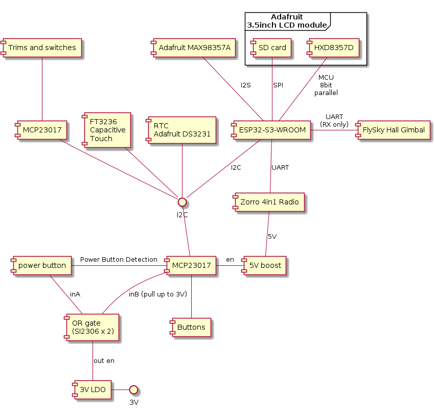

Use ESP-IDF 5 to build EdgeTX to run on ESP32S3

Get source code:
`git clone --recursive https://github.com/JunOllyLi/espidf5_edgetx.git`

Build:
This source tree build with ESP-IDF 5.2.1
`idf.py build`

System diagram:

